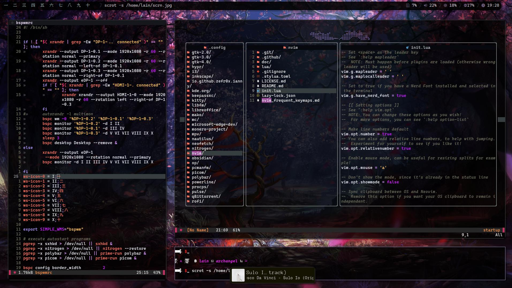

My dotfiles which I manage across different machines with Stow. If you want to use them, just place the pulled repo anywhere, get into 'dotfiles' folder and use 'stow --adopt PROGRAM' to make the dotfiles symlink to their proper places where programs will recognize them. The neovim configuration is based on Neovim Kickstart project and edited to my liking, large respect for the kickstart.nvim project for creating this great skeleton configuration.

See below for a quick overview of how this configuration looks like on my Arch machine. Please keep in mind that you will need to install corresponding packages and dependencies for these to work for you. Feel free to cherry-pick what you find interesting and play around with these configs to make them your own! What you see on the screenshot are: kitty as terminal emulator, neovim as text editor, wired as notification daemon, polybar as status bar, ftlabs-picom-git as a compositor, bspwm as a tiling window manager, starship as shell prompt configuration, CaskaydiaCove Nerd Font Mono font configured in Kitty, Agave Nerd Font Propo Regular and IPAPMincho Regular as additional fonts for Polybar. You will have to download the fonts for the configuration to work or change the fonts in the respective configurations to your liking. All of the used packages are available in AUR.

Please note that the .bashrc contains 'source $HOME/.aliases_private' line and that file is not included in the repo, since it contains aliases with sensitive information that I would not like to share. Consider deleting this line or creating your own .aliases_private file.

