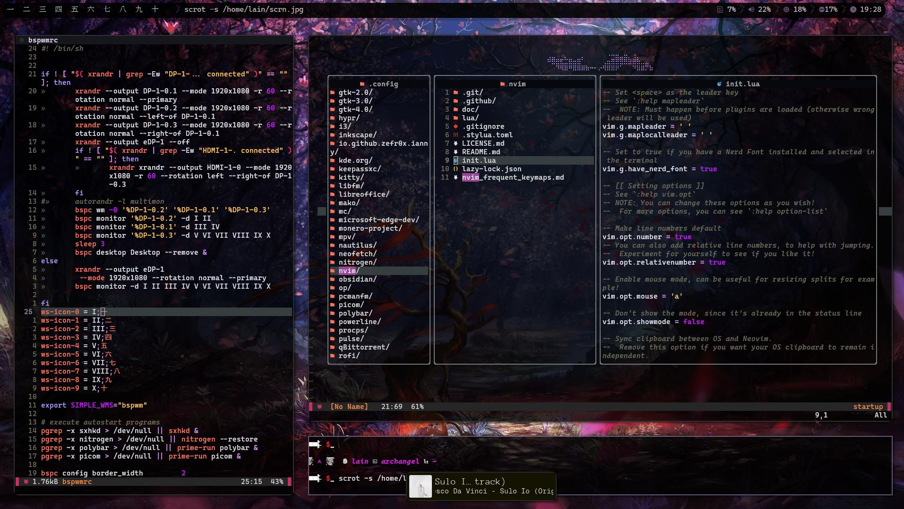
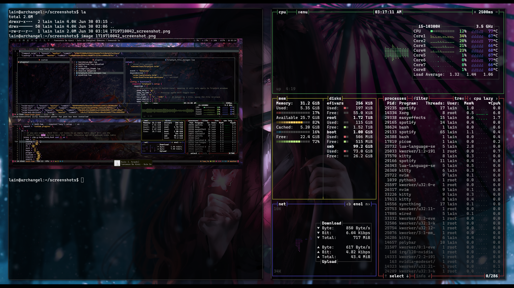

My dotfiles which I manage across different machines with Stow and Syncthing (which I recommend you to use too, since both are pretty based!). Some of these are complete, while some of these are work in progress either made from scratch or forked from other configurations. 

See below for a quick overview of how this configuration looks like on my Arch machine. Please keep in mind that you will need to install corresponding packages and dependencies for these to work for you. Feel free to cherry-pick what you find interesting and play around with these configs to make them your own! What you see on the screenshot are: Kitty as terminal emulator, Neovim as text editor, Wired as notification daemon, Polybar as status bar, Picom as a compositor, BSPWM as a tiling window manager, Starship as shell prompt configuration, CaskaydiaCove Nerd Font Mono font configured in Kitty, Agave Nerd Font Propo Regular and IPAPMincho Regular as additional fonts for Polybar.

Huge kudos to Neovim Kickstart project and all other developers that did the hard work, so I could have lots of fun with configuration and daily usage :)
