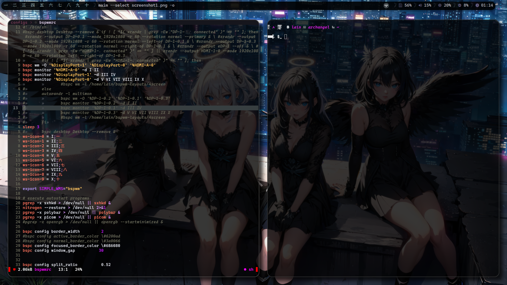
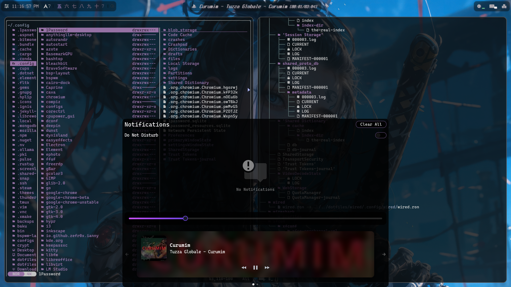

My dotfiles which I manage across different machines with stow. If you want to use them, just place the pulled repo anywhere, get into 'dotfiles' folder and use 'stow --adopt PROGRAM' to make the dotfiles symlink to their proper places where programs will recognize them. The new neovim configuration is based on LazyVim project and the old configuration is based on kickstart.nvim project. Huge thanks to both of the creators for making the process this much pleasant and quick to configure. There are multiple configurations I was basing my own on, which have their original authorship in their respective configuration files. Please note that the .bashrc and .zshrc files contain 'source $HOME/.aliases_private' lines and that file is not included in the repo, since it contains aliases with sensitive information that I would not like to share. Consider deleting this line or creating your own .aliases_private file.

<h1>X11 setup</h1>



Dependencies:

```kitty rofi neovim wired polybar ftlabs-picom-git bspwwm starship 'CaskaydiaCove Nerd Font' 'Agave Nerd Font' 'IPAPMincho Font' 'xorg drivers for your GPU as well as xorg-server'```

<https://github.com/user-attachments/assets/f1019dba-c9ac-4abf-99db-7b1efe6ca424>

<h1>Wayland setup</h1>



Dependencies
```wl-clipboard wl-clip-persist cliphist niri wayland qt5-wayland qt6-wayland swaync rofi-wayland waybar lm-sensors kitty yazi eza neovim 'Caskaydia Code Nerd Font' 'Terminess Nerd Font' 'IPAP Mincho font'```

<https://github.com/user-attachments/assets/81f7e865-cd6f-4241-a626-3047aa4fce6f>
